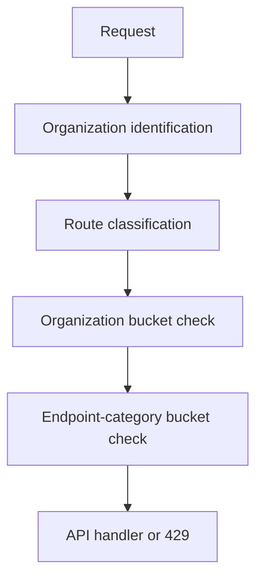

# API Rate Limiter Proof of Concept

This repository contains a compact FastAPI middleware layer that protects API routes using an in-memory token bucket rate limiter. It is designed for a 30–45 minute hiring challenge and prioritizes correctness, clear trade-offs, and a working end-to-end demonstration over production polish.

## What incident this addresses
A B2B SaaS platform experienced one client’s automated sync job consuming disproportionate capacity for hours and causing elevated latency for other tenants. This proof of concept adds enforcement before handlers run by applying two limits at once: one organization-wide and one endpoint-category limit.

## What the middleware does
- Enforces per-organization limits.
- Enforces per-endpoint-category limits.
- Uses a token bucket algorithm with a single in-process lock.
- Returns meaningful 429 JSON responses with Retry-After.
- Supports configuration through YAML without source-code changes.
- Exempts health and stats endpoints.

## Run it locally
```bash
python -m venv .venv
source .venv/bin/activate
pip install -r requirements.txt
uvicorn app.main:app --reload
```

## Run tests
```bash
pytest -q
```

## Trigger a 429
```bash
curl -i -H 'X-Org-ID: org-standard' http://127.0.0.1:8000/api/items
curl -i -H 'X-Org-ID: org-standard' -X POST http://127.0.0.1:8000/api/items -H 'Content-Type: application/json' -d '{"name":"demo"}'
```

## Configuration structure
The main configuration file is [config/rate_limits.yaml](config/rate_limits.yaml). It includes:
- plan definitions.
- organization-to-plan mapping.
- endpoint category limits.
- route classification rules.
- cleanup settings.
- exempt paths.

## Organization identification
The proof of concept uses the X-Org-ID header to identify the organization for protected routes. This is intentionally simple and explicit. In production, the organization should be derived from an authenticated principal or API key rather than a client-supplied header.

## Endpoint classification
Routes are classified through configuration and a simple method-based fallback. By default:
- GET, HEAD, OPTIONS -> read
- POST, PUT, PATCH, DELETE -> write
Routes like /api/reports are configured as expensive.

## How the limits interact
A request is allowed only when both of these pass:
- organization bucket
- endpoint-category bucket
The decision is made atomically under one in-process lock so a rejected request does not partially consume tokens from one bucket and not the other.

## Sliding-window algorithm
Each bucket stores a rolling history of request timestamps for the configured window. The limiter prunes timestamps that fall outside the window before evaluating a request. The burst value is interpreted as extra headroom on top of the base request limit, so the effective limit for a bucket is requests + burst.

## Retry-After calculation
When a bucket is at its limit, the limiter computes Retry-After from the oldest request still inside the rolling window.

## Concurrency handling
The limiter uses a threading.Lock and is safe for concurrent requests within one process. It does not provide cross-process atomicity or shared state across replicas.

## Memory cleanup
Idle buckets are removed after a configurable TTL. Cleanup is lazy and bounded by a configurable interval.

## Known failure modes
- State resets on process restart.
- Multiple app instances do not share quotas.
- A client can multiply effective quota across replicas.
- The X-Org-ID header is not secure authentication.
- The design is intended for local testing and a small proof of concept.

## Migration path to distributed infrastructure
A production version would move state to Redis or another shared atomic store and use a single atomic Lua script for refill, check, and consume. That would preserve fairness across replicas and support restart durability.

## What this proof of concept guarantees
- Middleware enforcement within one process.
- Configurable organization plans.
- Endpoint categories.
- Meaningful 429 responses.
- Retry calculations.
- Concurrency-safe in-process updates.
- Idle-state cleanup.

## What it does not guarantee
- Fair global enforcement across replicas.
- Persistence across restarts.
- Secure organization authentication.
- Protection against header spoofing.
- Dynamic config propagation.
- Production-grade observability.

## Mermaid diagram


## Section A: Architecture & Trade-offs
Write 300–500 words here covering algorithm choice, why token bucket was preferred over fixed window or sliding log, what the design handles well, where it breaks, how per-organization and endpoint limits interact, atomic in-process behavior, what would change with more time, why route classification belongs in middleware/configuration, and why organization identity should come from authentication in production.

## Section B: Production Readiness Plan
### B1 — Failure Modes & Scaling Plan
Write 200–300 words here explicitly covering restart reset behavior, fresh quotas after restart, acceptability for this proof of concept, why it is not ideal in production, what breaks across multiple instances, how clients can multiply quota across replicas, load balancer routing inconsistencies, Redis migration, Redis operations or scripts, memory growth, monitoring signals, and the importance of cleanup and bounded cardinality.

### B2 — Required Reasoning Question
CANDIDATE MUST COMPLETE WITHOUT AI ASSISTANCE

Describe a scenario where an AI coding assistant gives a plausible but incorrect answer for this problem. What would the incorrect output look like? How would you catch it before acting on it?

[Write your own answer here before submission.]

## Section C: AI Usage Log
A concise summary appears here; the detailed log is in [docs/AI_USAGE_LOG.md](docs/AI_USAGE_LOG.md).

## Demo
Run the demo script after starting the app:
```bash
python scripts/demo_rate_limit.py
```
